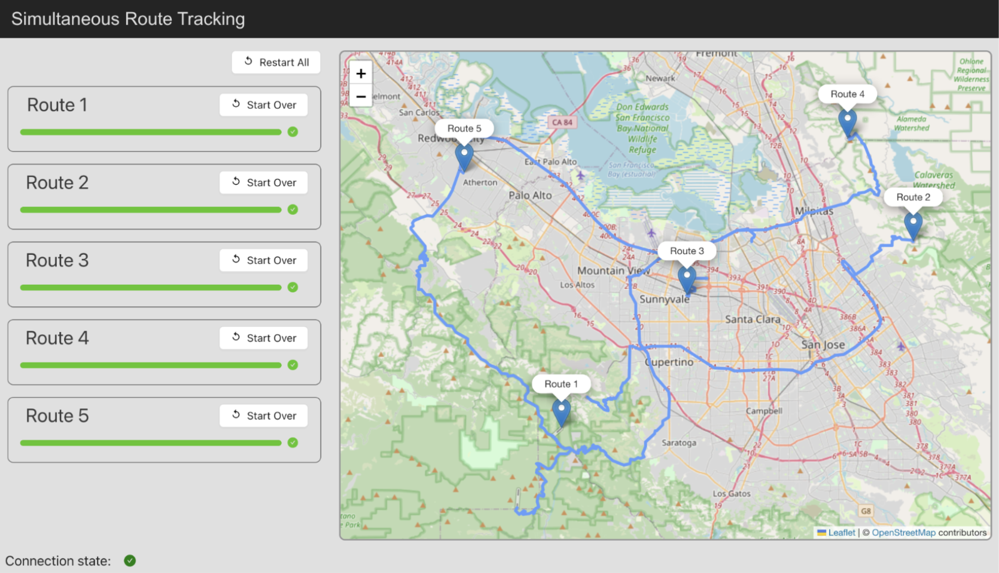
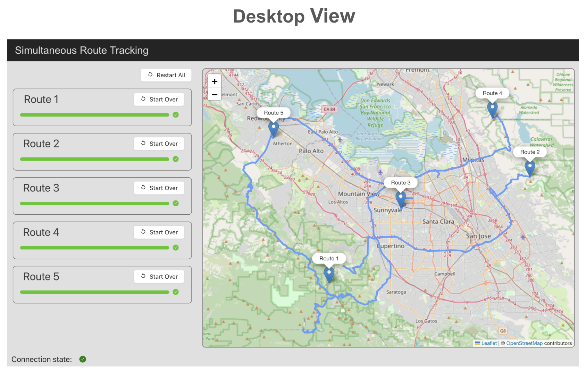
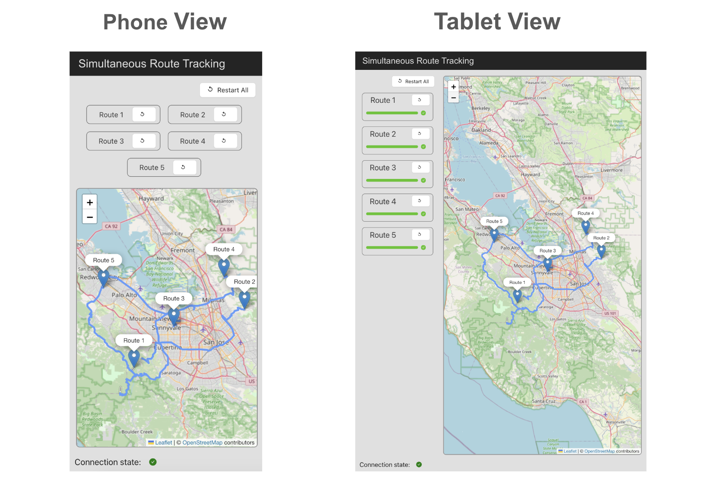
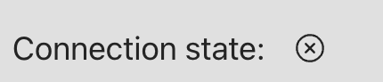
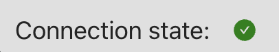

# TransitTrackr

## Project Overview and Task
TransitTrackr is a real-time public transport tracking web application that allows users to view and track the live locations of public transportation vehicles on a map. This application focuses on the San Jose, California area and simulates vehicle movement by generating routes with random coordinates.

<p align="left" style="margin-top:1rem; border-radius:16px">
  
</p>

---

## Features
- **Real-time Location Updates:** Display live, simulated locations of vehicles on a map.
- **Route Information:** View routes generated with random coordinates.
- **Interactive Map:** Utilize an interactive map to track transport movements.
- **WebSocket Integration:** Real-time updates facilitated through WebSocket connections.

## Tech Stack
- **Frontend:** React.js, Leaflet.js/Google Maps API, Styled-Components/Sass, Jest, Cypress
- **Backend:** Node.js, Express.js, Socket.IO, MongoDB, Mocha, Chai
- **DevOps:** Docker, Jenkins/GitHub Actions, NGINX
- **Others:** Git, npm/Yarn, ESLint, Prettier

## Getting Started

### Prerequisites
- Node.js and npm
- MongoDB
- Git

### Installation
1. **Clone the repository:**
   ```sh
   git clone https://github.com/mehmetakifakkus/TransitTrackr.git
   cd TransitTrackr
   ```
2. **Install Node.js dependencies:**
   ```sh
   npm install
   ```
3. **Set up MongoDB:**
   - Ensure MongoDB is running on your machine.
   - Create a database named `transittrackr`.

4. **Set up .env file:**
   - The project needs and .env file. Create an .env file at project root directory. 
   - You need to specify `MONGO_URI` variable.
   - You also need to have Google Map API key and specify `GOOGLE_MAPS_API_KEY` variable.

5. **Create ssl certificate for https and secure web socket:**
   - Create a directory named `certificates` at project root directory.
   - Create a self-signed certificate by running code below:
   ```sh
   openssl genrsa -out privatekey.pem 2048
   openssl req -new -key privatekey.pem -out csr.pem
   openssl x509 -req -days 365 -in csr.pem -signkey privatekey.pem -out certificate.pem
   ```
   - Place the generated `privatekey.pem` and `certificate.pem` files in the `certificates` directory.

6. **Start the server:**
   ```sh
   npm run generate
   npm start
   ```
   This will create an initial route with random coordinates and start the Node.js server on `https://localhost:443`. Note that the server will not start without a valid `.env` file. 
   
   You can also run create another random route by running `npm run generate` again.

7. **Running the Frontend:**
   - Navigate to the frontend directory, by typing `cd tracker-web`.
   - Install dependencies and start the React application as per the [frontend README](tracker-web/README.md) instructions.

## Using the Application
- Open the application in a web browser.
- Real-time vehicle movement is simulated using random coordinates in the San Jose area.
- You can view different routes, each generated with random waypoints.
- You can start all the routes by clicking the `Start All` button.
- You can restart all the routes by clicking the `Restart All` button. Or you can restart a certain route by clicking the `Restart` button on the route card.

## Folder Structure

- `models`: Contains the mongoose models used in the application. There are only one model for this project: **Route model:** stores route information 
- `screenshots`: Includes screenshots of the application.
- `tracker-web`: Contains the frontend React application.
- `components`: Contains reusable React components used throughout the application.
- `utils`: Contains utility functions used throughout the application.
  
## WebSocket Communication
- Upon loading the application, a WebSocket connection is established.
- Real-time location data is sent from the server to the client at regular intervals.
- WebSocket events are decribed below:
  - `connect`: Establish a WebSocket connection.
  - `startTravel`: Start sending location data for all routes to the client.
  - `startTravelById`: Start sending location data for a certain route to the client.

## RESTful API Endpoints
- `GET /api/routes`: Retrieve a list of all routes.
- `GET /api/routes/{id}`: Get detailed information about a specific route.

## Screenshots
The screenshots of the application are as follows. The application has a desktop mode which is shown below:

<p align="left" style="margin-top:1rem">
  
</p>

Project also has a mobile mode (covers smart phones and tablet size) which is shown below:
<p align="left" style="margin-top:1rem">
  
</p>
   
## Troubleshooting
   - Check your connection status. If you are seeing connection status as cross at the bottom of the page, then check your connection and check if the server is running at `https://localhost:443`. <p style="display:inline"></p> 
   - Make sure that you see the connection status as green.  <p style="display:inline"></p> 

   - If you are still having trouble, please contact me at @mehmetakifakkus

## Contributing
Contributions to the project are welcome! Please follow the standard fork and pull request workflow.

## License
This project is licensed under the [MIT License](LICENSE.md).

## Contact
- Project Link: [https://github.com/mehmetakifakkus/TransitTrackr](https://github.com/mehmetakifakkus/TransitTrackr)
- Author - [mehmetakifakkus](https://mehmetakifakkus.github.io)
  
---

This README provides a comprehensive overview of the project, including its features, tech stack, setup instructions, and usage. 

## References
- [Simple explanation of the web socket](https://www.wallarm.com/what/a-simple-explanation-of-what-a-websocket-is#:~:text=WebSocket%20uses%20a%20unified%20TCP,completed%2C%20the%20connection%20breaks%20automatically)
- [Getting started with React, Express, and Socket.io](https://medium.com/@vrinmkansal/getting-started-with-react-express-and-socket-io-658bbd441a9a)
- [Leaflet and React Tutorial](https://www.youtube.com/watch?v=WKaUkmQhRDY)
- [Creating Models in Mongoose](https://mongoosejs.com/docs/models.html)
- [Mongoose Queries](https://mongoosejs.com/docs/queries.html)
- [Using Cors in Express](https://medium.com/zero-equals-false/using-cors-in-express-cac7e29b005b)